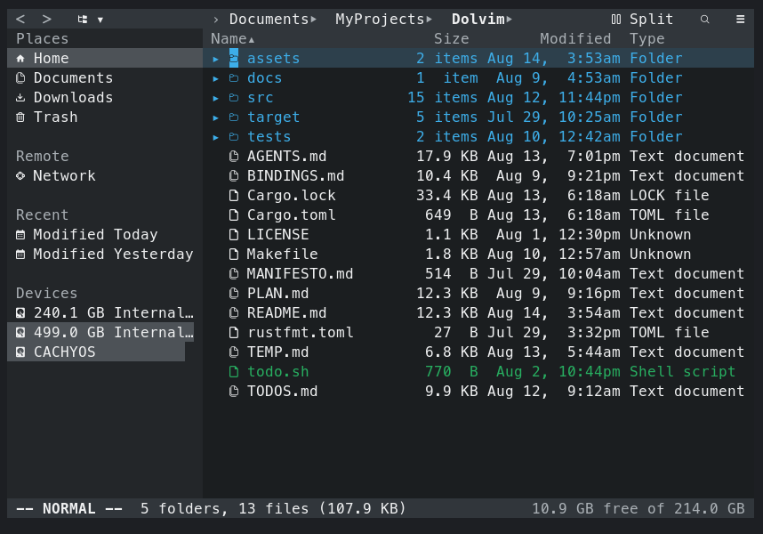

# Dolphin + vim = Dolvim

KDE Dolphin, recreated in the terminal, with vim bindings, written in rust btw.

A file manager that looks and behaves like Dolphin — Places panel, breadcrumb,
tabs, Details view, thumbnails, drag and drop, trash — driven by vim keys or the
mouse. Breeze colors, measured off a real Dolphin screenshot.

## Requirements

### Build

- A Rust toolchain with Cargo (the crate uses Rust 2021)
- `make`
- A system linker (normally installed with the platform's C development tools)

The Rust dependencies are fetched by Cargo; there is no `build.rs` and no
additional library needs to be installed manually. Build through the Makefile
as shown below.

### Runtime

- A truecolor terminal
- A Nerd Font patched terminal font — the icons are glyphs from it. Without one
  they render as tofu; alternatively, replace them with plain Unicode in
  `src/config.rs` and recompile. Every glyph must exist in the selected font:
  falling back to a proportional font shifts the columns after it.
- `xdg-mime` and `xdg-open` from `xdg-utils`, for MIME detection and opening
  files. Text files without an association use `$VISUAL`, `$EDITOR`, or `vi`,
  in that order.
- Standard Linux utilities `date` and `df`, used for local timestamps and disk
  space.

`bat` is optional rather than a compile requirement. Dolvim uses these optional
helpers when their corresponding feature is needed:

| Helper | Feature |
|---|---|
| `bat` | Syntax-highlighted text previews in the information panel |
| `pdftotext`, `antiword`, `pandoc` | PDF, `.doc`, and `.docx` previews |
| `unzip`, `7z`, `bsdtar` | Archive previews |
| `git` | Treat entries ignored by a local `.gitignore` as hidden |
| `lsblk`, `udisksctl` | List, mount, and unmount devices in Places |
| `wl-copy`/`wl-paste`, `xclip`, or `xsel` | Clipboard interoperability with other applications |
| `ripdrag` or `dragon-drop` (`dragon`) | Drag and drop across the terminal boundary |
| `xdotool` | Position the drag helper under X11 |
| `alacritty` | The default `Shift+F4` terminal; change `TERMINAL_COMMAND` in `src/config.rs` to use another terminal |

Missing optional helpers only disable the associated integration. Image
thumbnails for JPEG, PNG, GIF, BMP, and WebP are built in and need no external
program.

## Build

	make            # release build into target/release/dolvim
	make debug      # unoptimised, for a backtrace worth reading

## Install

	make && sudo make install

Installs to `/usr/local/bin/dolvim`. Build unprivileged and install privileged —
`make install` deliberately does not build, because under `sudo` cargo runs as
root, where rustup has no default toolchain.

	sudo make install PREFIX=/usr    # somewhere else
	make install DESTDIR=/tmp/stage  # stage it, no root needed
	sudo make uninstall

## Use

	dolvim [DIR]

With no argument it opens the current directory. Press `:help` inside for the key
list.

### Neovim integration

The companion Lua module in the Neovim configuration makes `nvim DIR` start
one persistent Dolvim process in the initial window.
Opening a file turns that same process into a left sidebar and opens the file in
the parent Neovim. `<leader>e` hides and restores the terminal from either
normal or terminal mode without discarding selection, expanded folders, or
history.

The module starts the public integration mode directly:

    dolvim --editor-connect 127.0.0.1:PORT --editor-token TOKEN [DIR]

Both options are required and are intended for an editor-owned localhost
listener, not interactive use. Protocol paths and the initial root must be
absolute UTF-8 paths. Standalone invocation and external file opening are
unchanged.

V1 deliberately rejects background copy, move, restore, and drop transfers in
integrated mode. This keeps editor shutdown and connection-loss cleanup honest:
Dolvim can exit promptly without terminating a transfer halfway through a file.
Standalone transfers remain available.

To diagnose an unexpected integration shutdown, set `DOLVIM_EDITOR_LOG` to an
append-only log path when the editor starts Dolvim, for example:

    DOLVIM_EDITOR_LOG=/tmp/dolvim-editor.log nvim DIR

The log records timestamps, process IDs, protocol events, transport errors, and
whether the peer or Dolvim initiated closure. Authentication tokens are always
redacted. Protocol paths are recorded, so treat the file as private and remove
it after debugging.

## Keybindings

Show keybindings

The current state of the keymap. `src/config.rs` is authoritative:
`KEY_BINDINGS` contains every exact keybinding with its explicit modes, while
`CHORDS`, `NAV_BUTTONS`, and `RIGHT_BUTTONS` describe multi-key grammar and
toolbar layout. If the code and this file disagree, this file is stale.

Vim-like and Dolphin-like labels in `KEY_BINDINGS` are comments only. There is
no table precedence: a modifier/key pair may appear more than once only when
its mode sets do not overlap. In Normal and Visual modes, an unbound printable
key still falls through to Dolphin's jump-to-name; text-entry modes insert it.

**Leader is `<Space>`.**

---

### Motion

| Key                  | Does                                                      |
|---                   |---                                                        |
| `h` `j` `k` `l`      | left / down / up / right, grid-aware (see below)          |
| `H`                  | up to the parent folder                                    |
| `L`                  | open the item under the cursor                             |
| `gg` / `G`           | first / last item                                         |
| `5gg`                | item 5 — a count before `gg` is a line number, as in vim  |
| `5j` `3k`            | counts prefix any motion                                  |
| `0` / `$`            | start / end of the row                                    |
| `Ctrl+d` / `Ctrl+u`  | half page down / up                                       |
| `Ctrl+f` / `Ctrl+b`  | page down / up                                            |
| `gu`                 | up to the parent folder                                   |
| `gh`                 | home                                                      |
| `Enter`              | open                                                      |
| `Ctrl+Enter`         | open a folder in a new tab                                |
| `Backspace`, `Alt+↑` | up                                                        |
| `Alt+←` / `Alt+→`    | back / forward in history                                 |
| `F5`                 | refresh                                                   |

`h`/`l` depend on how the view flows, and only ever move the cursor:

| View    | `h` / `l`                             | `j` / `k`                    |
|---      |---                                    |---                           |
| Icons   | walk the row                          | cross to the row above/below |
| Compact | cross to the column left/right        | walk the column              |
| Details | nothing — the view is one column wide | previous / next item         |

Directory navigation is view-independent: `H` goes to the parent and `L` opens
the item under the cursor. Lowercase `h`/`l` remain cursor motions.

### Marks

| Key         | Does                                |
|---          |---                                  |
| `m{letter}` | remember where this pane is pointed |
| `'{letter}` | go back to it                       |

The letter can be anything, including a letter the keymap binds: `md` marks, it
does not delete. Marks remember a *target*, so the Trash and a saved search can
be marked as readily as a folder. They last for the session.

### Selection

| Key            | Does                                                       |
|---             |---                                                         |
| `v` / `V`      | visual / visual by row; the same key again leaves          |
| `Ctrl+Space`   | toggle the item under the cursor                           |
| `Ctrl+A`       | select all                                                 |
| `Ctrl+Shift+A` | invert the selection (needs the kitty keyboard protocol)   |
| `Esc`          | clear the selection, cancel a pending count / chord / mark |

### Files

| Key                       | Does                                                        |
|---                        |---                                                          |
| `x` / `5x`                | trash the item / n items (purges when already in the Trash) |
| `dd` `3dd` `dj` `dk` `dG` | trash a range — `d` is an operator and takes a motion       |
| `Del` / `Shift+Del`       | trash / delete forever                                      |
| `Ctrl+C` `Ctrl+X`         | copy / cut                                                  |
| `p`, `Ctrl+V`             | paste                                                       |
| `cw`, `F2`                | rename (batch when several are selected)                    |
| `o` / `O`                 | new file / new folder                                       |
| `F10`, `Ctrl+Shift+N`     | new folder                                                  |
| `u`                       | undo                                                        |
| `Alt+Enter`               | properties                                                  |

### View

| Key                        | Does                                          |
|---                         |---                                            |
| `Ctrl+1` `Ctrl+2` `Ctrl+3` | icons / compact / details                     |
| `zv`                       | cycle the view mode                           |
| `zc` / `zo`                | close / open the folder under the cursor       |
| `za`                       | toggle the folder under the cursor             |
| `zC` / `zO`                | close / open that folder recursively           |
| `zM` / `zR`                | close / open all folds                         |
| `<Space>h`                 | show hidden files                             |
| `F3`                       | split view                                    |
| `F9`                       | places panel                                  |
| `F11`                      | information panel                             |
| `Ctrl+I`                   | filter bar                                    |
| `Tab`                      | swap panes                                    |
| `Ctrl+h/j/k/l`              | request focus left/down/up/right               |

### Tabs pane and toolbar row

`Ctrl+h/j/k/l` always requests directional focus from the current region;
bare `h/j/k/l` remains local to that region. With more than one tab, repeated
`Ctrl+k` walks file view → tabs → breadcrumb. With one tab the tabs region is
skipped. Hidden Places and a disabled split are skipped, and focus never wraps
at an outer edge. The Places panel steps up to the navigation buttons.

| Key                            | Does                                          |
|---                             |---                                            |
| `Ctrl+k` / `Ctrl+j`            | focus the pane above / below                  |
| `h` / `l` (in tabs)            | previous / next tab                           |
| `Ctrl+h` / `Ctrl+l` (in tabs) | focus the left / right file view              |
| `Ctrl+h` / `Ctrl+l` (toolbar) | nav buttons → trail → right buttons           |
| `h` / `l` (toolbar)            | previous / next item; a menu button opens     |
| `j` / `k`, `Ctrl+n` / `Ctrl+p` | down / up an open menu                        |
| `Ctrl+y`, `Enter`, `Tab`       | accept                                        |
| `Esc`                          | cancel                                        |

Buttons, left to right: Back, Forward, View-mode menu · *breadcrumb* · Split,
Search, Hamburger menu. The hamburger is where `m` used to go.

### Tabs, search, commands

| Key                      | Does                                              |
|---                       |---                                                |
| `Ctrl+T` / `Ctrl+W`      | new / close tab                                   |
| `gt` / `gT`              | next / previous tab                               |
| `Ctrl+Tab` / `Shift+Tab` | next / previous tab                               |
| `/` `n` `N`              | search, next, previous                            |
| `:`                      | command line — `:e :cd :sort :view :vsplit :q :qa` |
| `F6`                     | edit the path                                     |
| `F4` / `Shift+F4`        | shell (suspends Dolvim)                           |
| `F1`                     | help                                              |
| `Ctrl+Q`                 | quit                                              |

---

### Deliberately unbound

Keys whose vim meaning the program cannot honour yet. Each is left free rather
than given to something else, so that adding the real feature does not have to
take a key back.

| Key       | Vim means                       | Why it is free                                                                                                |
|---        |---                              |---                                                                                                            |
| `?`       | search backward                 | There is no backward search yet. Help is `F1`.                                                                |
| `y`       | an operator — `yy`, `yw`, `3yy` | It was an immediate copy, which made it the odd key out beside `d`. Waiting on `y{motion}`. Copy is `Ctrl+C`. |
| `P`       | paste before the cursor         | It held drop-in, which is not a paste.                                                                        |
| `D`       | `d$`                            | It held drag-out, which is not a delete.                                                                      |
| `r`       | replace one character           | It renamed immediately. Rename is `cw` or `F2`.                                                               |
| `<Space>` | —                               | It is the leader. Use `Ctrl+Space` to toggle one item, `v` for a range, or the mouse.                          |

Drag-out and drop-in still work from the mouse. `Action::DragOut` and `DropIn`
are still in the code, unbound and marked as such.

### Still missing

Vim keys a user will reach for and not find: `Ctrl+r` (redo — `u` currently
undoes with no way back), `.` (repeat), `{` / `}`, `w` / `b`, `''`.

`H`/`L` are Vimium's, not vim's — vim spells them "cursor to the top / bottom of
the screen", which leaves `M` stranded with no siblings. `Ctrl+h` / `Ctrl+l` for
focus are tmux's convention, not vim's `Ctrl+w h`.

## Configure

Configuration is source code. Colors, glyphs, and keys are `const` tables in
`src/config.rs` — edit, recompile, done. There is no dotfile and no config
parser.

## License

MIT.
