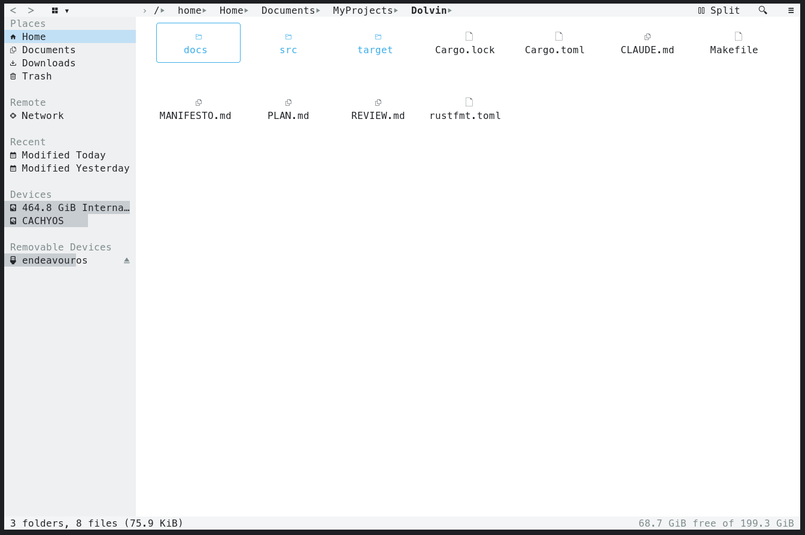

# dolvim

KDE Dolphin, recreated in the terminal.

A file manager that looks and behaves like Dolphin — Places panel, breadcrumb,
tabs, Details view, thumbnails, drag and drop, trash — driven by vim keys or the
mouse. Breeze colors, measured off a real Dolphin screenshot.

## Build

	make            # release build into target/release/dolvim
	make install    # cargo install --path .

Needs a truecolor terminal and a Nerd Font patched font for the icon glyphs.
Without one they render as tofu; swap them in `src/config.rs` and recompile.

## Use

	dolvim [DIR]

With no argument it opens the current directory. Press `F1` inside for the key
list.

## Configure

Configuration is source code. Colors, glyphs, and keys are `const` tables in
`src/config.rs` — edit, recompile, done. There is no dotfile and no config
parser.

## License

MIT.
